# Berka RF Visualization Report

## Configuration
- RF base model + blended calibrator with alpha=0.2 after warmup=8 weeks.
- Blending is evaluated in per-user chronological walk-forward mode.
- Golden sanity: predicted class match rate = 1.000 on 10 rows

## Overall quality snapshot
| Variant | Accuracy | Macro-F1 |
| --- | ---: | ---: |
| RF base | 0.5058 | 0.4878 |
| Blended | 0.5215 | 0.5005 |
| Persistence | 0.2644 | 0.1986 |

## A) Confusion matrices
- RF base:
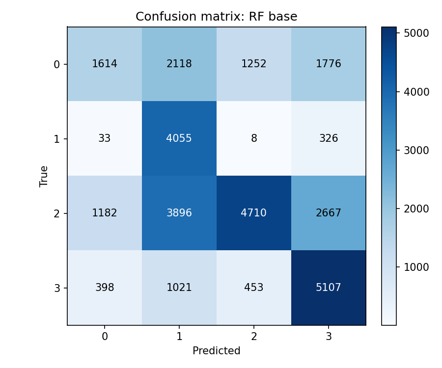
- Blended:
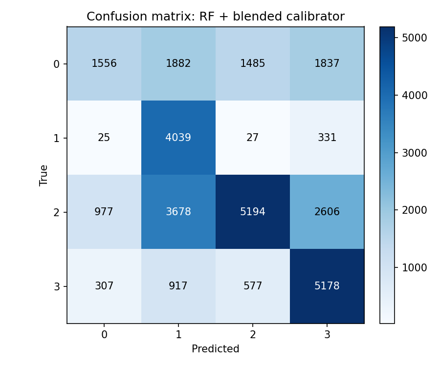
- Persistence baseline:
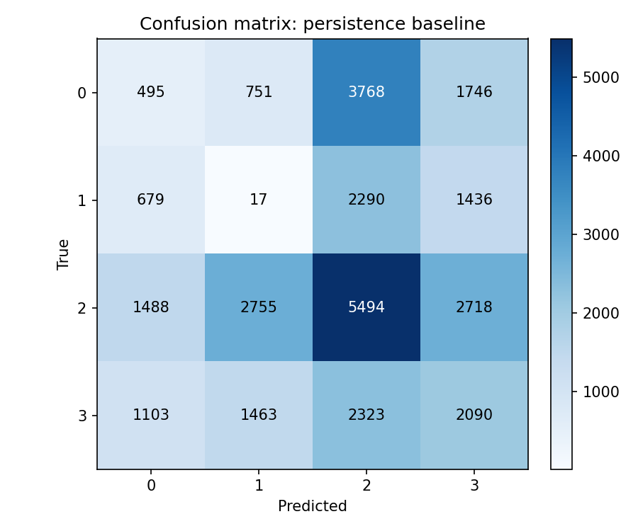

Quick takeaway: heatmaps show whether predictions collapse into one bucket (one dominant column). RF vs blended vs persistence highlights where errors move.

## B) Time-series traces per user
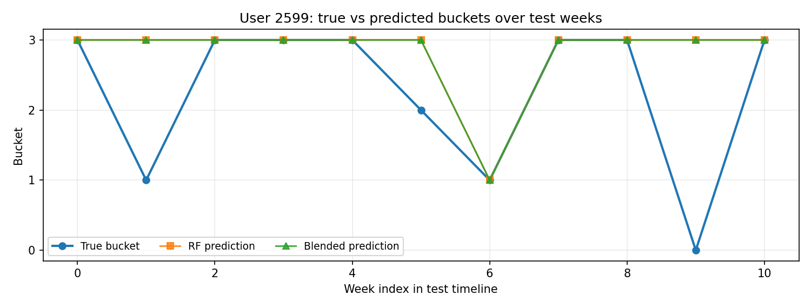
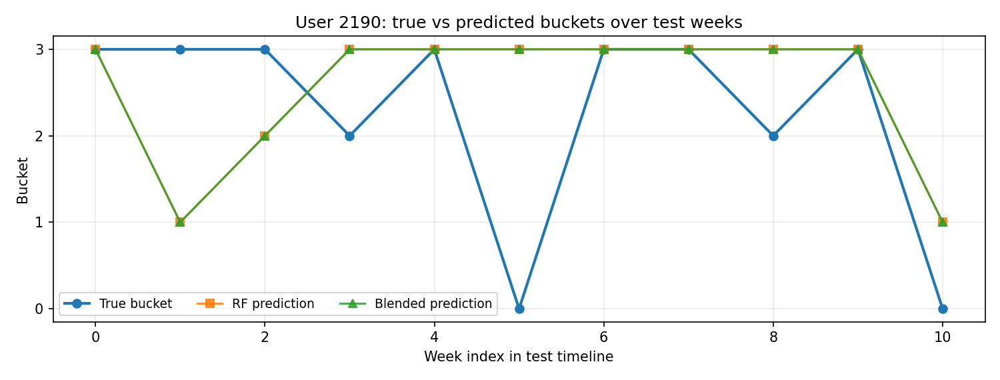
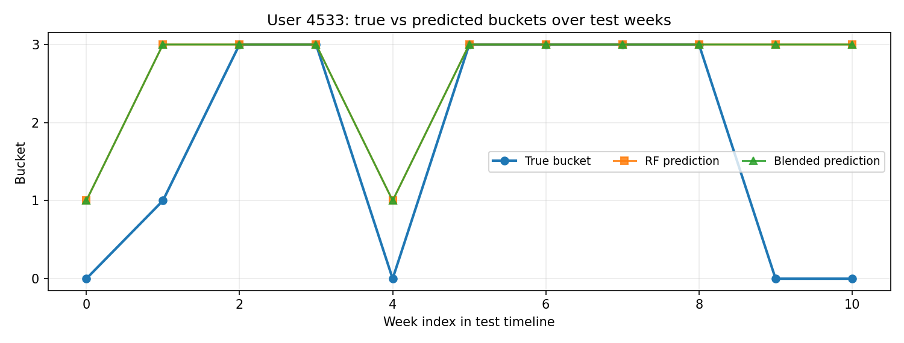
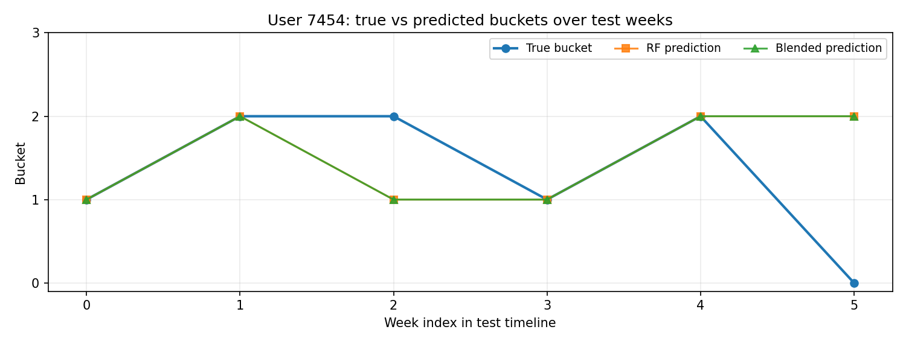
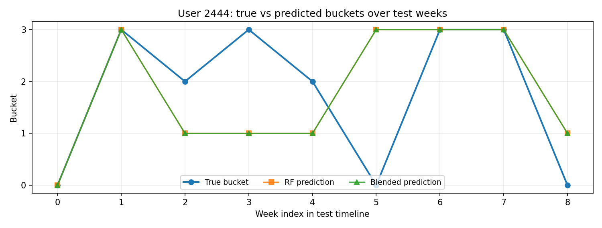
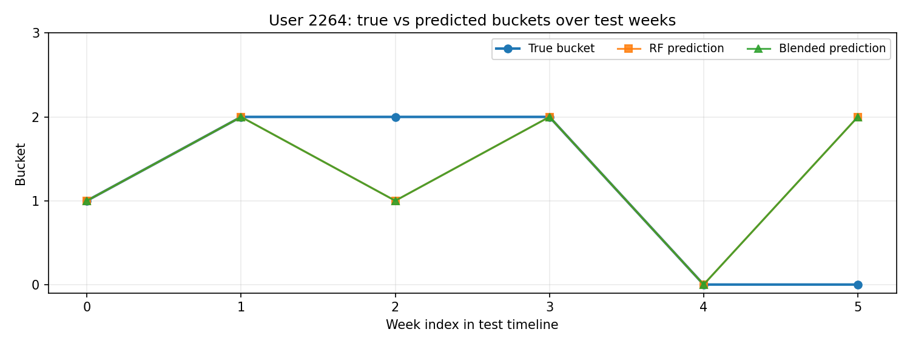

Quick takeaway: traces show week-by-week behavior and where blended smoothing helps or misses true transitions.

## C) Transition-focused evaluation
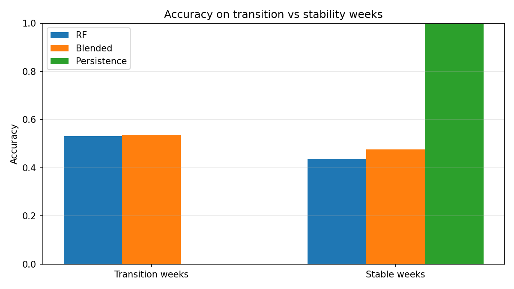

- Transition weeks accuracy: RF=0.5312, Blended=0.5375, Persistence=0.0000
- Stable weeks accuracy: RF=0.4353, Blended=0.4771, Persistence=1.0000

## D) Confidence vs accuracy
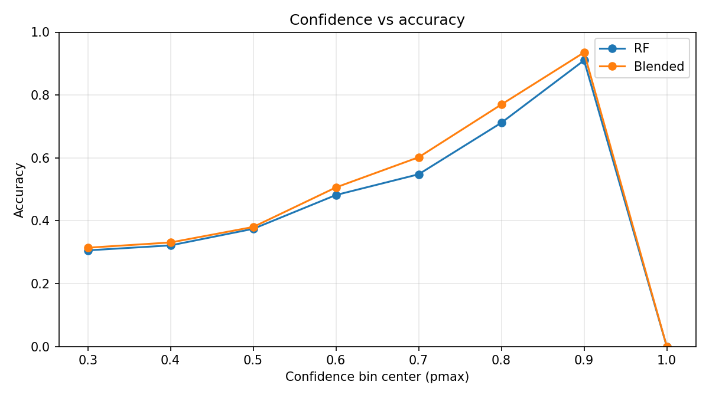

Quick takeaway: this curve shows how pmax correlates with correctness; higher confidence should align with higher accuracy.

## E) Per-user behavior
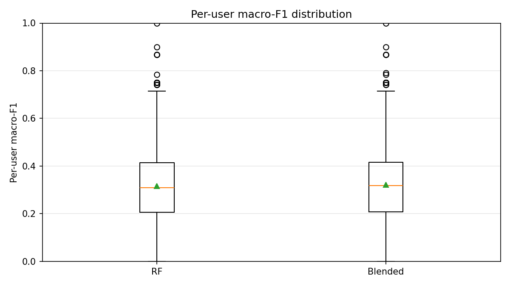
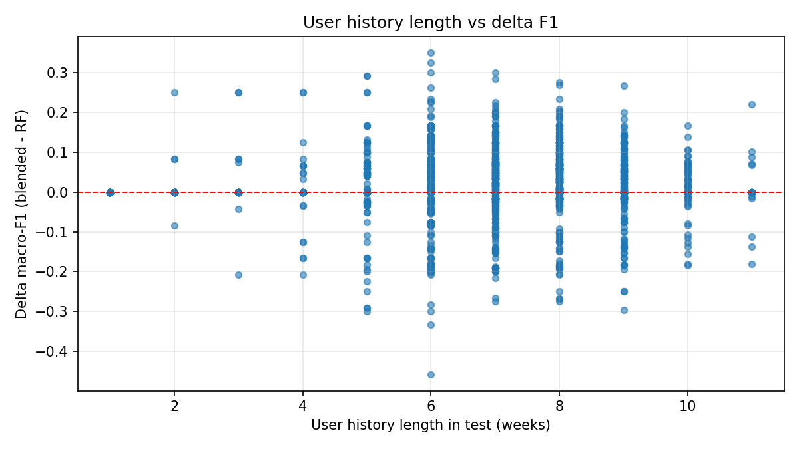

- Mean delta F1 (blended - RF): 0.0057
- Users improved: 748
- Users worsened: 375

Also check `predictions_sample.csv` for a tabular sample across 5-10 users.
